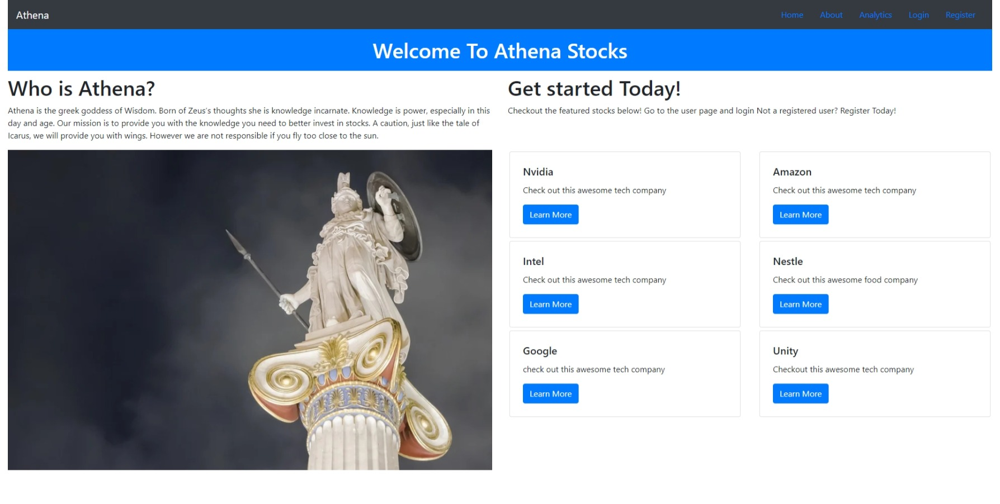
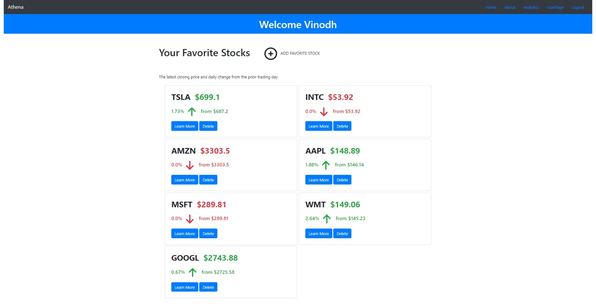
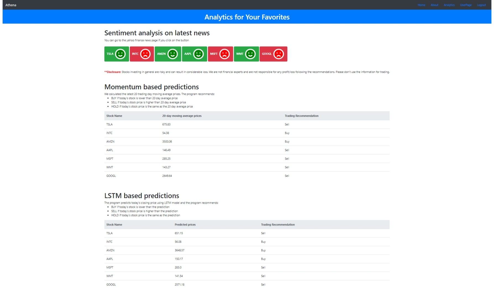

# **Athena_Stocks**

by [Aditya Sharoff](asharoff@pdx.edu), [Felina Kang](felina2@pdx.edu), [Haeyoon Chang](haeyoon@pdx.edu) and [Vinodh Kotipalli](vkotipa2@pdx.edu) 2021

---
<!-- Disclaimer -->
<p style="font-size: 16px;"><b style="color:red;">Disclaimer:</b> Stocks investing in general are risky and can result in considerable loss. This is a academic project and we are not financial experts and are not responsible for any profit/loss from provided recommendations. Please don't use the information for trading.</p>

---

<!-- TABLE OF CONTENTS -->
<details open="open">
  <summary><h2 style="display: inline-block">Table of Contents</h2></summary>
  <ol>
    <li>
      <a href="#project-description">About The Project</a>
      <ul>
        <li><a href="#web-development-stack">Web Development Stack</a></li>
      </ul>
    </li>
    <li>
      <a href="#getting-started">Getting Started</a>
      <ul>
        <li><a href="#prerequisites">Prerequisites</a></li>
        <li><a href="#installation">Installation</a></li>
      </ul>
    </li>
    <li>
      <a href="#project-status">Project Status</a>
      <ul>
        <li><a href="#roadmap">Roadmap</a></li>
        <li><a href="#work-summary">Work Summary</a></li>
      </ul>
    </li>
    <li>
      <a href="#examples-and-screen-captures">Examples and Screen Captures</a>
    </li>
    <li>
      <a href="#acknowledgements">Acknowledgements</a>
    </li>
    <li>
      <a href="#license">License</a>
    </li>
  </ol>
</details>

<!-- PROJECT DESCRIPTION -->

## **Project Description**
---

This is a web application. One stop shop for collection of Data Analytics and Data Visualization tool(s) to help with stock market trading decision making. We came across several open source AI/ML models and they were reported to have varying degrees of success on the historical data. However the real test is to see how well these models function current real world data and test the performance against real and/or simulated investments. For this end, we have two pronged approach.
  * Use custom web-scraper to collect the relevant data about selected stock(s) needed AI/ML models  and store then in database.
  * Run the stored time series datasets in the database through collection of AI/ML models to provide predictions on future stock trends which can be useful buy/sell/hold kind of decision making. 

In order to make process more user friendly and get quick enough feedback to users we plan to build a web application with a simple UI containing follow minimum features
* Users can create personal user accounts to enter list of stock(s) 
* Provide quick summary user's favorite stock prices
* Provide analytics tools to show sentiment analysis and buy/sell recommendations based on prediction models.


**Note**: This application doesn't support features to make the actual financial transactions. Please don't use the information for trading.

## **Web Development Stack**
---
* Frontend
  * HTML
  * CSS/Bootstrap
  * Python Django
* Backend
  * Python Django
  * Python AI/ML, Web-Scrapper support libraries
* Database
  * PostgreSQL

<!-- GETTING STARTED -->

## Getting Started
---
To get a local copy up and running follow these simple steps.

### **Prerequisites**
---

* Python
* Poetry (Python packaging and dependency management)
* VS Code (or any other editer of your preference)
* Python Libraries (already defined in pyproject.toml)
  * Django
  * GoogleNews
  * yfinance
  * etc

### **Installation**
---

1. Fork the repo under your github account 
  
2. Clone the repo
   ```sh
   git clone https://github.com/<GitHubID>/Athena_Stocks.git
   ```
3. Install required packages
     * Install poetry for python virtual environment (skip if already installed)
    ```sh
    curl -SSL https://raw.githubusercontent.com/sdispater/poetry/master/get-poetry.py | python
    ```
    * configure poetry to create virtual environment in project path
    ```sh
    poetry config virtualenvs.in-project true
    ```
    * Install dependencies and create python virtual environment (`Athena_Stocks/.venv` will have virtual python environment)
    ```sh
    cd Athena_Stocks

    poetry install
    ```
4. Setup database in local repo (need this step after cloning the repo fir first time)
   ```sh
    poetry run python .\django_project\manage.py makemigrations

    poetry run python .\django_project\manage.py migrate
   ```
   
4. Start the Local server and open server link in browser
   ```sh
    poetry run python .\django_project\manage.py runserver
   ```
5. Source code is available in the folder `django_project` shown below is list of implementation file that may interest you
     ```bash
    ├── django_project
    │   ├── django_project
    |   ├── stocks
    |   ├── users
    |   ├── stock_analytics
    |   │   ├── momentum.py
    |   │   ├── lstm.py 
    |   │   ├── stocknews.py   
    |   │   └── sentiment.py
    |   │       ...      
    │   └── manage.py
    │   ...
    ├── pyroject.toml
    ├── LICENSE
    └── README.md
    ```
6. Additional information on poetry for developers 
   * To use the already created python virtual environment 
    ```sh
    poetry env use python
    ```
    * To run the python code 
    ```sh
    poetry run python <filename>.py
    ```
    * To add/remove more python packages to virtual environment 
    ```sh
    poetry add <package-name>

    poetry remove <package-name>
    ```  
      Note: Additional resources for poetry https://python-poetry.org/docs/ 


## **Project Status**
---
Below is the list of features/activities we focused on for this project so far
* Built UI, backend and data pipeline using Django
* Built infrastructure and support for integrating prediction models. 
* Integrated two recent price history based prediction models into analytics page
  * momentum trading
  * Simple LSTM based on price history 
* Currently, loading time for the analytics is high because following reason 
  * Models have to be trained individually use dta of each stock
  * Recent stock history is fetched live to have relevant data for training.
  * Currently, models are not saved in database, which adds training time into loading delay.
  * We plan to improve loading time by saving the trained models in next versions
* We integrated sentiment analysis based on recent financial news into analytics page.
* We also built another LSTM model to include sentiment analysis, but couldn't integrate as it would make loading time of analytics page longer. 
* We tried to build the application modular enough to swap/add more models in future. 

### **Roadmap**
---
Here are the high level summary of tasks and progress made so far

- [x] **Web-Scraper** for Data Collection
  - [x] Gather historic/current prices of selected stock(s) and store to DB
  - [x] Gather historic/current news relevant to selected stock(s) `+` URL(s) and store to DB
- [x] **AI/ML models** to process collected data and provide predictions
  - [x] Generate Abstracted-Text summary of new articles collected by Web-Scraper
  - [x] Generate sentiment scores based on the generated summary
  - [x] Price based ML models for buy/sell/hold predictions for a given stock
  - [x] Sentiment analysis based prediction model 
- [x] **Backend** on server side
  - [x] Build backend server using Django library
  - [x] Infrastructure in integrate AI/ML models for stock prediction
- [ ] **Frontend UI** on client side
  - [x] Ability for user to enter the stock(s) they are interested in for day-to-day tracking 
  - [x] Data Visualization tool(s) for performance statistics on selected stock(s)
  - [ ] Analytics page for frontend integration of AI/MI models
    - [x] Price based prediction models
    - [ ] Sentiment analysis based prediction models
  - [ ] Ability for user to enter there personal portfolio across multiple platforms through CSV file
  - [ ] Data Visualization tool(s) for statistics on user portfolio
- [x] **Database**
  - [x] Define Schema for storing User Accounts and time series dataset for the stock(s)
  - [x] Implement database interaction based on the Schema 
- [ ] **Testing and Deployment** on server side
  - [x] Build and test app on localhost
  - [ ] Create email for the organization and heroku account associated with it.
  - [ ] Deploy the application using the organization's heroku account. 


### **Work Summary**
---
Here is the details on individual contributions 
* **Aditya Sharoff** focused on 
  * Building Django infrastructure
  * etc... Add details here
* **Felina Kang** focused on 
  * Frontend design
  * etc... Add details here
* **Haeyoon Chang** focused on 
  * Momentum trading prediction model 
  * Price based LSTM  prediction model
  * Analytics page integration
  * etc... Add details here
* **Vinodh Kotipalli** focused on 
  * Web-scrapping to gathering news articles for a given stock
  * Sentiment analysis based on the news articles
  * Prices and sentiment scores based LSTM prediction model

## **Examples and Screen Captures**
---
* Home Page
&nbsp;
* Example User Page
  &nbsp;
* Example Analytics Page
  &nbsp;

## **Acknowledgements**
---
* [Open Source Collection Machine Learning models of Stock Prediction](https://awesomeopensource.com/project/huseinzol05/Stock-Prediction-Models)
* [Webscraping and text summation of new articles](https://towardsdatascience.com/easily-scrape-and-summarize-news-articles-using-python-dfc7667d9e74)
* [Sentiment analysis using NLTK](https://realpython.com/python-nltk-sentiment-analysis)
* [Sentiment analysis using textblob](https://stackabuse.com/sentiment-analysis-in-python-with-textblob/)
* [Example multivarient time series LSTM implementation using Keras](https://machinelearningmastery.com/multivariate-time-series-forecasting-lstms-keras/)
* [Example keras LSTM for stock price prediction](https://www.kdnuggets.com/2018/11/keras-long-short-term-memory-lstm-model-predict-stock-prices.html)
* [newspaper3k pypi library documentation](https://pypi.org/project/newspaper3k)
* [GoogleNews pypi library documentation](https://pypi.org/project/GoogleNews)
* [pygooglenews pypi library documentation](https://pypi.org/project/pygooglenews)
* [yfinance pypi library documentation](https://pypi.org/project/yfinance)
* [Stackoverflow, making Pandas DataFrame apply() use all cores](https://stackoverflow.com/questions/45545110/make-pandas-dataframe-apply-use-all-cores)
* [Stackoverflow, converting string input of of form 'x days ago' to python datetime](https://stackoverflow.com/questions/12566152/python-x-days-ago-to-datetime)
* Meghan Mueller-Cox and Shay Green for examples of README markdown from previous projects. 
* [How to display flash messages in Django templates](https://pythoncircle.com/post/700/how-to-display-flash-messages-in-django-templates)
* etc.. Add details here

## **License**
---
This work is made available under the "MIT License". Please
see the file `LICENSE` in this distribution for license
terms.


